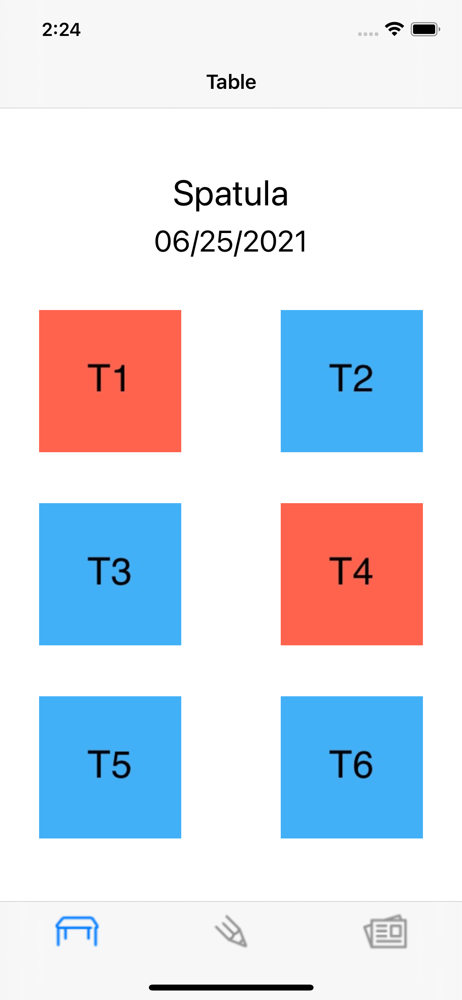

# Restaurant App

A Restaurant Management App which will allows for storing of orders for specific tables and saves previous orders.  
Made by Bennie Chen for CSE 390 (Mobile App Development) 

## Table of Content

* [Screens](#screens)
* [Sources](#sources)

## Screens

## Sources
