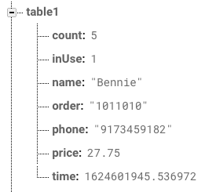

# Restaurant App

A Restaurant Management App which will allows for storing of orders for specific tables and saves previous orders.  
Made by Bennie Chen for CSE 390 (Mobile App Development) 

## Table of Content

* [Details](#details)
* [Screens](#screens)
* [Database Attributes](#database-attributes)
* [Sources](#sources)

## Details
* Developing for iOS
* Language of Choice: Swift
* Database of Choice: Firebase
## Screens
Main Screen  
This screen contains the table in the restaurant. If the table is Blue then it is avalible, if it is read, then the table is currently taken
  
Reciept Screen  
This screen shows the Main Screen in a Table View and provides more information for all 6 tables. Deleting a table is the same as clearing the table and allowing the table to be avalible again. Avaliable tables are not displayed. 
  
Summary Screen 
This screen provides a summary view of all the orders tha have been completed (deleted from the table). It provides the total revenue and a history of all deleted orders
  
Order Screen 
This screen is used to enter data about the customer and the food the customer would like to order. Each customer is limited to 9 of each item. 
  
History Screen 
This screen is used to show the Order History, specifically for tables that have left.
  
Settings Screen 
This screen will allow the user to customize how the History Table is being displayed. There are different sort view and the user can choose for the data to be ascending or descending.
  
History Order Screen 
This screen will show the information of orders that has been completed along with a Table View that only has the items they ordered
 
## Database Attributes
The firebase  database holds 7 attributes which are used to identify the customer. The attributes include the count (number of people), inUse (checks if the table is avalible), name of the cusomter, order (Strng representing the order), phone number, total price, and the time the customer came to the restaurant. 

## Sources
* Logo Source
	* App Icon: https://www.surrenderat20.net/2019/07/731-pbe-update-new-summoner-icons-tft.html
	  * Courtesy of Riot Games
	* Tab Bar Icon: https://thenounproject.com/term/minimal/

